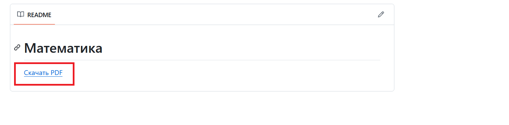
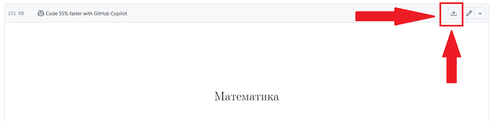

<!DOCTYPE html>
<html lang="en">
<head>
  <meta charset="UTF-8">
  <meta name="viewport" content="width=device-width, initial-scale=1.0">
</head>
<body>
  <h1>Математика</h1>
  <a href="https://github.com/Iwon720/matematyka/blob/main/matematyka.pdf">
    <button>Скачать PDF</button>
  </a>
  
Теперь здесь будет находиться самая последняя версия моего материала по математике.   Ниже приведена инструкция, как скачать самую последнюю версию.

  
Сначала тебе надо будет перейти вниз страницы и нажать на ссылку:

  
  
Отлично, у тебя должен был открыться страшный интерфейс, но не пугайся, тебе лишь надо найти вот эту кнопку и нажать на нее:

  
  
Вот и все! Если что-то непонятно или не работает, обязательно напиши мне что не так. Спасибо. Ссылка находится сверху.

</body>
</html>
